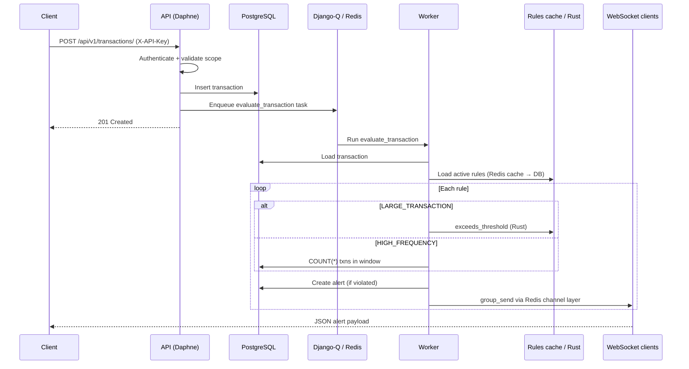
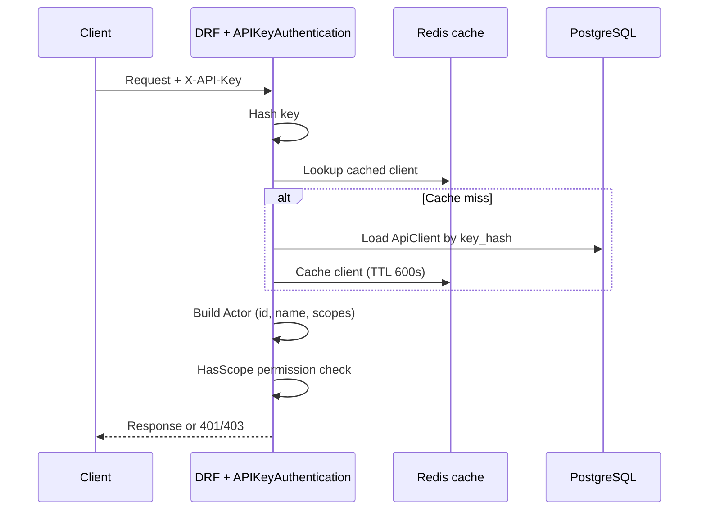
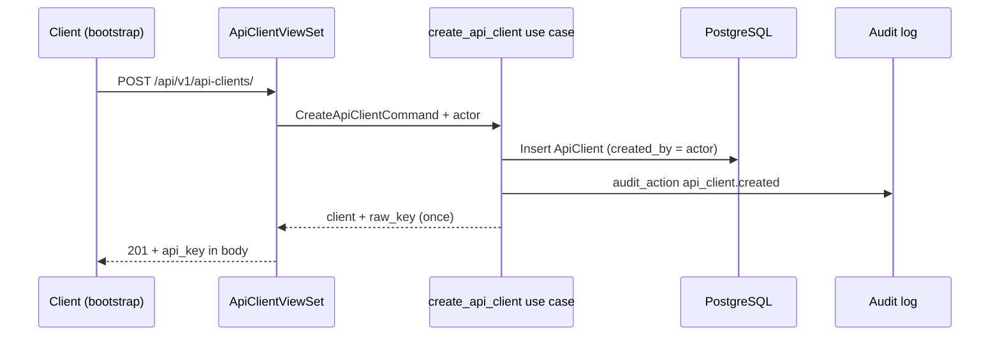

# SmartComply Transaction Monitoring Service

A transaction monitoring API that ingests payments, evaluates configurable rules, raises alerts, and streams them in real time. Built as a take-home assessment with clean architecture, scoped API keys, audit logging, and a Rust-backed rule evaluator.

## Stack

| Layer | Technology |
|-------|------------|
| API | Django 5, Django REST Framework, drf-spectacular |
| Async worker | Django-Q2 |
| Real-time | Django Channels + Daphne (WebSocket) |
| Data | PostgreSQL 16 |
| Cache / queue / channels | Redis 7 |
| Rule engine (hot path) | Rust `tm_rules` (PyO3) — large-transaction compare |
| Runtime | Docker Compose, Python 3.12, Poetry |

## Quick start

**Prerequisites:** [Docker](https://docs.docker.com/get-docker/) and Docker Compose only. No local Python or Poetry required.

```bash
cp .env.example .env
# Edit .env — set SECRET_KEY, POSTGRES_PASSWORD, DATABASE_URL, BOOTSTRAP_API_KEY
docker compose up --build
```

| Service | Role |
|---------|------|
| `postgres` | Primary database |
| `redis` | Cache, Django-Q broker, WebSocket channel layer |
| `api` | HTTP + WebSocket (migrations + seed on startup) |
| `worker` | Background rule evaluation |

- **API:** http://localhost:8000  
- **Health:** http://localhost:8000/health  
- **Swagger UI:** http://localhost:8000/api/docs/  
- **OpenAPI schema:** http://localhost:8000/api/schema/  

Schema and docs are **public** (no API key). All `/api/v1/*` endpoints require `X-API-Key`.

### Environment variables

| Variable | Purpose |
|----------|---------|
| `SECRET_KEY` | Django secret (use single quotes if value contains `$`) |
| `POSTGRES_PASSWORD` | Postgres password |
| `DATABASE_URL` | Must use host `postgres` and match password |
| `BOOTSTRAP_API_KEY` | Seeds the `platform-admin` client on first run |
| `REDIS_URL` / `CHANNEL_REDIS_URL` | Redis for cache/queue vs channels (pre-set for Docker) |

### Bootstrap flow

1. `seed_data` creates **`platform-admin`** (from `BOOTSTRAP_API_KEY`) and two default rules.
2. `platform-admin` can only manage API keys — use it once to create a **full-scoped** working key (see below).
3. Use that new key for everything else (transactions, rules, alerts, Swagger, WebSocket).

**`platform-admin`** sees **all** API clients; other keys only see clients they created.

### Tests

```bash
docker compose run --rm test
docker compose run --rm test pytest tests/integration -v
```

Tests use in-memory SQLite (`DJANGO_ENV=test`). The `test` service is not started by `docker compose up`.

### Stop / reset

```bash
docker compose down          # stop
docker compose down -v       # stop + wipe database
```

---

## API documentation (Swagger)

All endpoints, scopes, and request bodies: **http://localhost:8000/api/docs/**

OpenAPI schema: **http://localhost:8000/api/schema/**

In Swagger, click **Authorize** and set `X-API-Key` to your working key (not the bootstrap key — `platform-admin` cannot call transactions, rules, or alerts).

### Create a full-scoped API key

Run once after `docker compose up`. Replace `BOOTSTRAP_KEY` with the value from `.env`:

```bash
curl -X POST http://localhost:8000/api/v1/api-clients/ \
  -H "Content-Type: application/json" \
  -H "X-API-Key: BOOTSTRAP_KEY" \
  -d '{
    "name": "dev-operator",
    "scopes": [
      "transactions:write",
      "transactions:read",
      "rules:write",
      "rules:read",
      "alerts:read",
      "alerts:stream",
      "audit:read",
      "api_clients:write",
      "api_clients:read",
      "api_clients:manage"
    ]
  }'
```

Copy `api_key` from the response — it is shown **once**. Use it in Swagger and for all other requests.

### WebSocket

```
ws://localhost:8000/ws/alerts/?api_key=<your-dev-operator-key>
```

Requires `alerts:stream` on the key (included above).

```bash
npx wscat -c "ws://localhost:8000/ws/alerts/?api_key=YOUR_KEY"
```

---

## Monitoring rules

Two rule types (mutually exclusive fields):

| Type | Fields used | Default (seeded) | Trigger |
|------|-------------|------------------|---------|
| `LARGE_TRANSACTION` | `amount_threshold` | 10,000 | `amount > threshold` (Rust evaluator) |
| `HIGH_FREQUENCY` | `frequency_limit`, `window_hours` | 5 txns / 24h | `COUNT(*)` in window **>** limit (6th txn alerts) |

Unused fields are stored as `null` (e.g. large-tx rules have `frequency_limit: null`).

Frequency alerts are **deduplicated** per `account_id` for 24h (Redis).

---

## Architecture

Clean architecture per app: `api/` → `usecases/` → `domain/` → `infrastructure/`.

```
src/
├── config/           # settings, ASGI, URLs
├── apps/
│   ├── identity/     # API keys, scopes, auth
│   ├── transactions/ # ingest + list
│   ├── rules/        # rule CRUD, cache, Rust evaluator
│   ├── alerts/       # evaluation, worker task, WebSocket
│   ├── audit/        # audit log decorator + list API
│   └── core/         # middleware, logging, pagination
└── rust/tm_rules/    # PyO3 crate (exceeds_threshold)
```

### Sequence: transaction ingest → alert → WebSocket



### Sequence: API key authentication



### Sequence: create API client (audit)



---

## Audit log

| Action | When |
|--------|------|
| `api_client.created` | `POST /api/v1/api-clients/` |
| `api_client.updated` | `PATCH /api/v1/api-clients/{id}/` |
| `rule.created` | `POST /api/v1/rules/` |

Raw API keys are never logged.

---

## Design notes

- **Rules cache:** Active rules cached in Redis (60s TTL); invalidated on rule create.
- **Rust:** Used for `amount > threshold` only; frequency counting is a Postgres `COUNT(*)`.
- **WebSocket:** Subscribes to group `alerts`; requires `alerts:stream` scope.
- **Idempotency:** Duplicate `transaction_id` or rule `name` returns **409 Conflict**.

---

## API key rotation

Keys cannot be retrieved after creation. Deactivate via `PATCH /api/v1/api-clients/{id}/` (`is_active: false`) and create a new client.
